# Assignment #4 — Environmental Sound Classification
**Alexandria University · CSE: Pattern Recognition**

## Project Structure

```
urban_sound_classification/
├── dataset_utils.py     # Loading, waveform/spectrogram visualisation
├── features.py          # Feature extraction (Mel, MFCC, Energy, Chroma, …)
├── data_loader.py       # PyTorch Dataset & DataLoader, augmentation
├── models.py            # GRU, CNN-GRU, AttentionGRU architectures
├── train.py             # Training loop, early stopping, checkpointing
├── evaluate.py          # Confusion matrix, metrics, comparison plots
├── run_experiments.py   # Full experiment suite runner
└── requirements.txt
```

---

## 1. Installation

```bash
pip install -r requirements.txt
```

> **GPU users:** install the CUDA-enabled PyTorch wheel from https://pytorch.org first.

---

## 2. Download the Dataset

1. Go to https://urbansounddataset.weebly.com/urbansound8k.html
2. Fill in the form and download `UrbanSound8K.tar.gz`
3. Extract it:
   ```bash
   tar -xzf UrbanSound8K.tar.gz
   ```
4. The extracted directory looks like:
   ```
   UrbanSound8K/
       audio/
           fold1/  fold2/  …  fold10/
       metadata/
           UrbanSound8K.csv
   ```

---

## 3. Quick Start

### Explore the dataset
```python
from dataset_utils import load_metadata, summarise_dataset, explore_dataset

df = load_metadata("/path/to/UrbanSound8K")
summarise_dataset(df)
explore_dataset(df, "/path/to/UrbanSound8K", n_per_class=1)
```

### Train a single model
```bash
python train.py \
    --dataset_root /path/to/UrbanSound8K \
    --feature_type combined \
    --model gru \
    --hidden_size 128 \
    --num_layers 2 \
    --epochs 50 \
    --batch_size 64 \
    --lr 1e-3 \
    --cache_dir ./feature_cache \
    --output_dir ./runs/gru_combined
```

### Run all experiments
```bash
python run_experiments.py \
    --dataset_root /path/to/UrbanSound8K \
    --epochs 50 \
    --cache_dir ./feature_cache \
    --output_dir ./runs
```

Quick smoke-test (3 epochs, first 2 experiments):
```bash
python run_experiments.py \
    --dataset_root /path/to/UrbanSound8K \
    --epochs 3 --subset 2
```

---

## 4. Features

| Feature       | Dim (default) | Description                          |
|---------------|:---:|--------------------------------------|
| `mel`         | 64  | Log-power Mel spectrogram            |
| `mfcc`        | 120 | MFCCs + Δ + ΔΔ (40 coeffs each)     |
| `energy`      | 1   | Short-time RMS energy                |
| `chroma`      | 12  | Chroma (12 pitch classes)            |
| `contrast`    | 7   | Spectral contrast (6 bands + 1)      |
| `zcr`         | 1   | Zero-crossing rate                   |
| `combined`    | 205 | All of the above concatenated        |

---

## 5. Models

| Name        | Description                              |
|-------------|------------------------------------------|
| `gru`       | Bidirectional multi-layer GRU + attention pooling  *(required)* |
| `cnn_gru`   | CNN encoder → BiGRU *(bonus)*            |
| `attn_gru`  | Multi-head self-attention → BiGRU *(bonus)* |

---

## 6. Evaluation Outputs

Each experiment directory contains:
- `best_model.pt`         — best checkpoint (by val accuracy)
- `history.json`          — per-epoch train/val loss & accuracy
- `results.json`          — final val + test accuracy and F1
- `history.png`           — training curves
- `confusion_matrix.png`  — normalised confusion matrix

The master run directory additionally contains:
- `all_results.json`      — aggregated results table
- `model_comparison.png`  — accuracy & F1 bar chart across all experiments

---

## 7. Experimental Results

The best performing experiment was the CNN-GRU model using the full `combined` feature set:

- `cnn_gru_combined_h128_l2_d3`
  - Validation accuracy: **76.34%**
  - Validation F1-macro: **77.88%**
  - Test accuracy: **78.10%**
  - Test F1-macro: **79.60%**

### Model-specific results

#### `gru_mel_h128_l2_d3`
- Feature set: `mel`
- Test accuracy: **57.17%**
- Test F1-macro: **60.57%**
- Notes: This baseline model demonstrates that Mel spectrogram features alone are not sufficient for the full 10-class UrbanSound8K classification task. The model struggles with acoustically similar classes such as `engine_idling`, `drilling`, and `children_playing`.

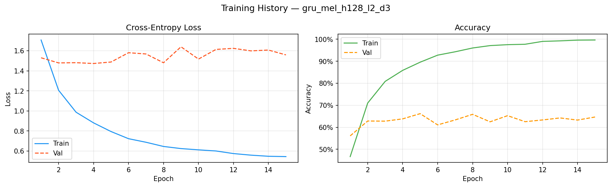
*GRU model with Mel features — training history.*


*Normalised confusion matrix for `gru_mel_h128_l2_d3`.*

#### `gru_mfcc_h128_l2_d3`
- Feature set: `mfcc`
- Test accuracy: **62.25%**
- Test F1-macro: **64.09%**
- Notes: MFCC features improve over Mel alone, indicating that the cepstral representation helps the GRU model better distinguish spectral shape differences.

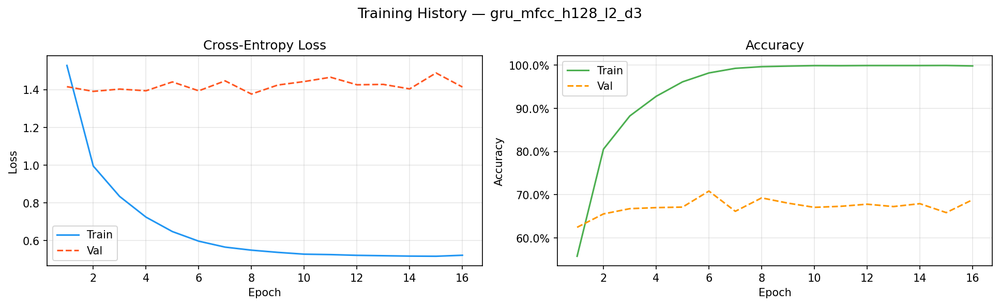
*GRU model with MFCC features — training history.*

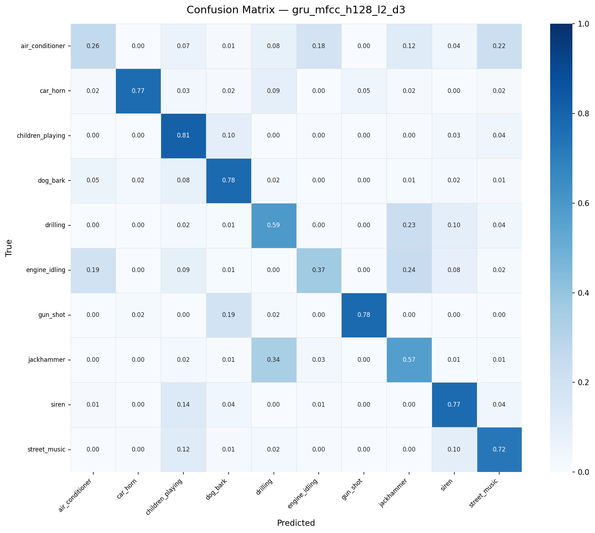
*Normalised confusion matrix for `gru_mfcc_h128_l2_d3`.*

#### `gru_combined_h128_l2_d3`
- Feature set: `combined`
- Test accuracy: **73.56%**
- Test F1-macro: **75.40%**
- Notes: Combining Mel, MFCC, energy, chroma, contrast, and ZCR yields a much stronger representation than any single feature subset.

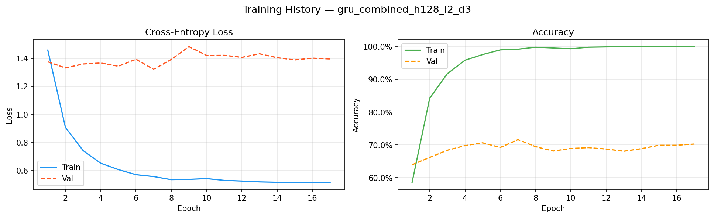
*GRU model with combined features — training history.*

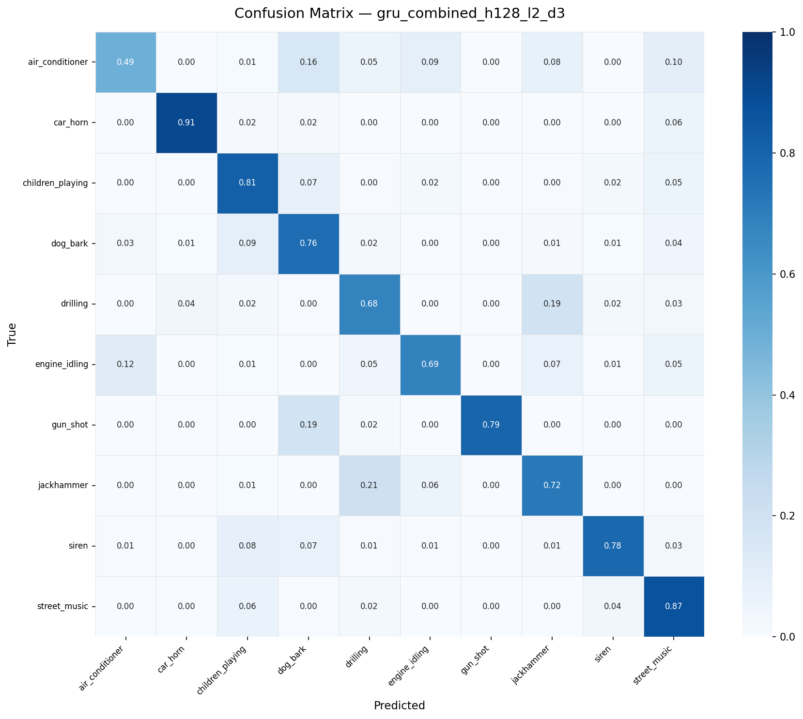
*Normalised confusion matrix for `gru_combined_h128_l2_d3`.*

#### `gru_combined_h128_l3_d3`
- Feature set: `combined`
- Test accuracy: **73.26%**
- Test F1-macro: **74.92%**
- Notes: Adding a third GRU layer provided no meaningful improvement, suggesting that this problem is better solved by stronger feature encoding than deeper recurrent stacks.

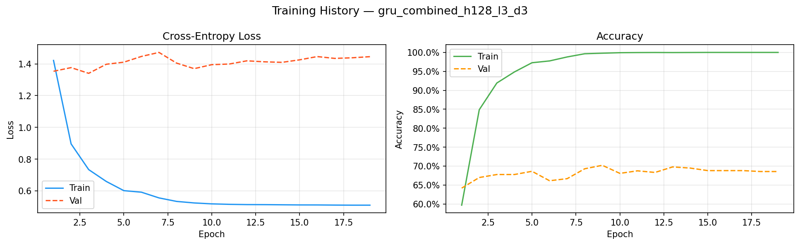
*GRU model with 3 layers — training history.*

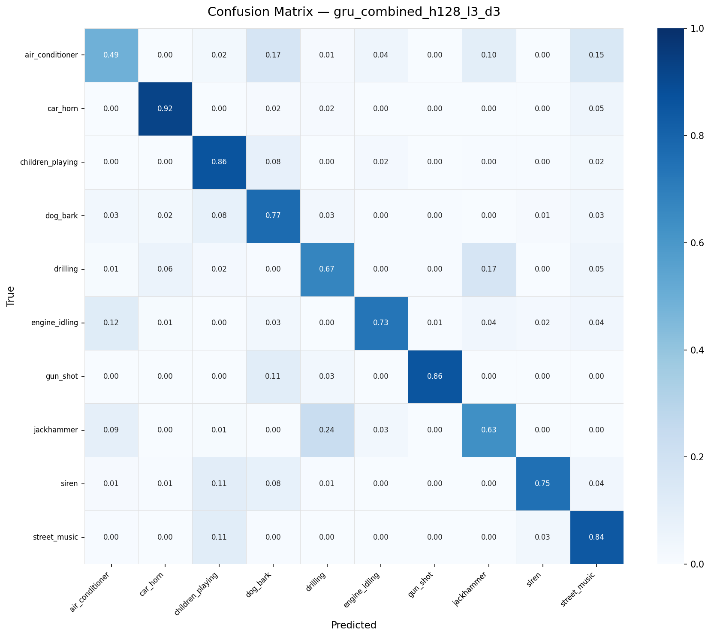
*Normalised confusion matrix for `gru_combined_h128_l3_d3`.*

#### `gru_combined_h256_l2_d3`
- Feature set: `combined`
- Test accuracy: **73.50%**
- Test F1-macro: **74.09%**
- Notes: Doubling hidden state size did not improve results, indicating the original GRU size was sufficient for the representational capacity needed.

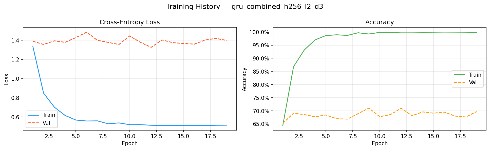
*GRU model with 256 hidden units — training history.*

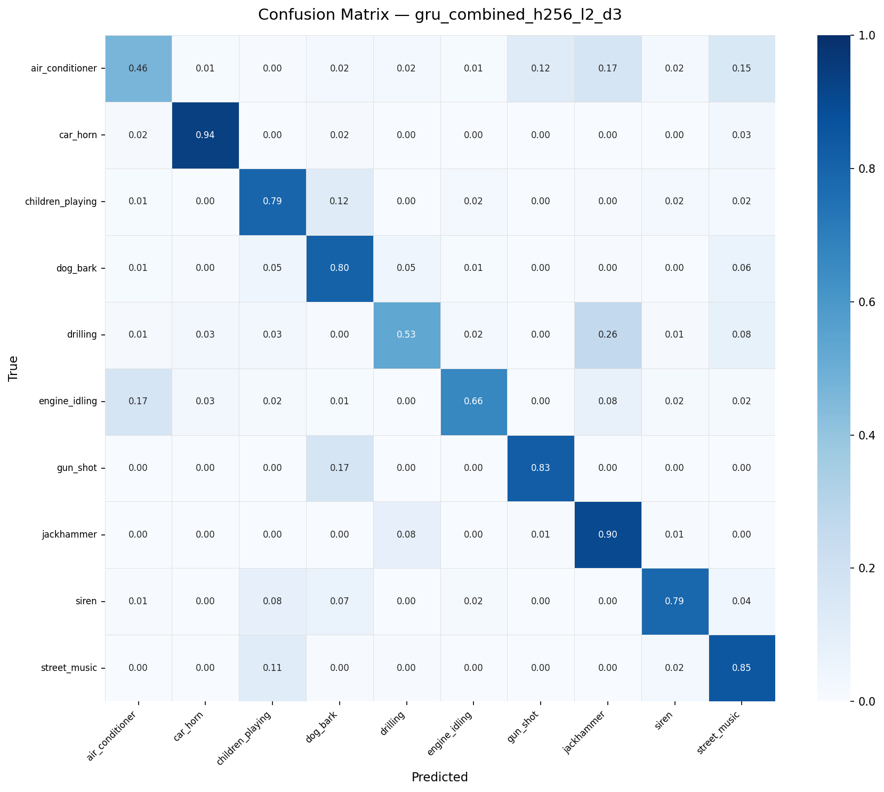
*Normalised confusion matrix for `gru_combined_h256_l2_d3`.*

#### `gru_combined_h128_l2_d5`
- Feature set: `combined`
- Test accuracy: **71.02%**
- Test F1-macro: **72.40%**
- Notes: Increasing dropout to 0.5 reduced performance, implying that the model was already under-regularized rather than overfitting.

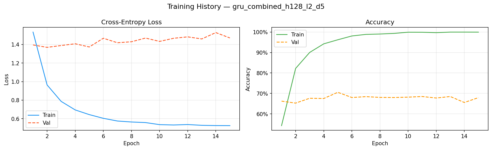
*GRU model with higher dropout — training history.*


*Normalised confusion matrix for `gru_combined_h128_l2_d5`.*

#### `gru_combined_h128_l2_d3_aug`
- Feature set: `combined`
- Test accuracy: **73.56%**
- Test F1-macro: **75.40%**
- Notes: The augmentation setup used in this run did not yield a measurable improvement. Further refinement of augmentation techniques is recommended.

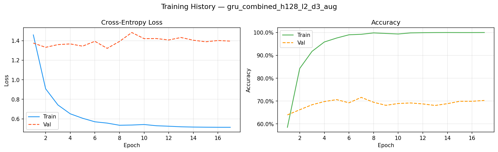
*GRU model with augmentation — training history.*


*Normalised confusion matrix for `gru_combined_h128_l2_d3_aug`.*

#### `cnn_gru_combined_h128_l2_d3`
- Feature set: `combined`
- Test accuracy: **78.10%**
- Test F1-macro: **79.60%**
- Notes: The CNN-GRU architecture is the best-performing model in this lab. The convolutional encoder improves feature extraction before temporal modeling.

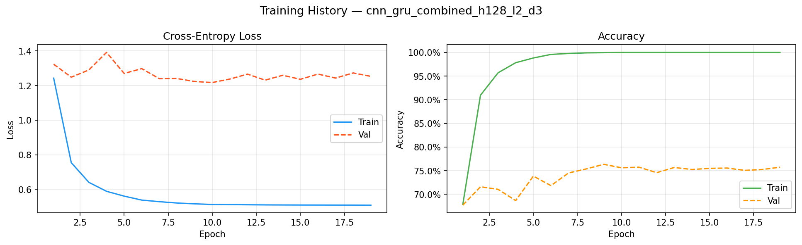
*CNN-GRU model with combined features — training history.*

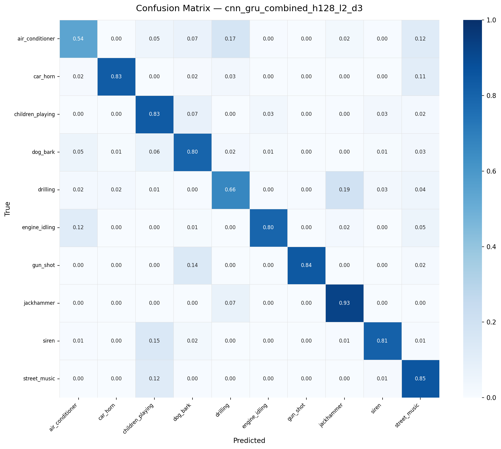
*Normalised confusion matrix for `cnn_gru_combined_h128_l2_d3`.*

### Summary comparison

| Experiment | Test Accuracy | Test F1-Macro | Notes |
|------------|:-------------:|:-------------:|------|
| `cnn_gru_combined_h128_l2_d3` | **78.10%** | **79.60%** | Best overall model |
| `gru_combined_h128_l2_d3` | 73.56% | 75.40% | Strong baseline |
| `gru_combined_h128_l3_d3` | 73.26% | 74.92% | Deeper model, no gain |
| `gru_combined_h256_l2_d3` | 73.50% | 74.09% | Wider model, no gain |
| `gru_combined_h128_l2_d5` | 71.02% | 72.40% | Higher dropout reduced performance |
| `gru_combined_h128_l2_d3_aug` | 73.56% | 75.40% | Augmentation not beneficial here |
| `gru_mfcc_h128_l2_d3` | 62.25% | 64.09% | MFCC-only baseline |
| `gru_mel_h128_l2_d3` | 57.17% | 60.57% | Mel-only baseline |

### Visual summaries

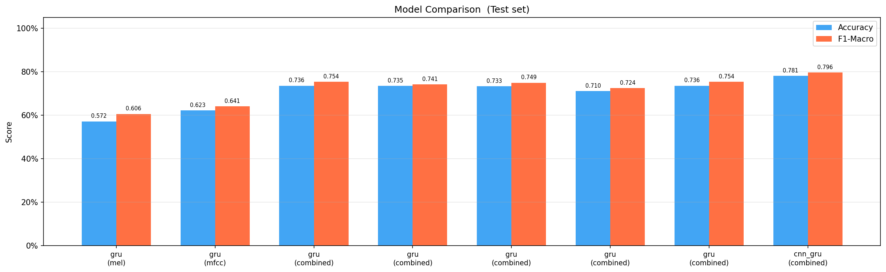

The comparison chart clearly shows that the CNN-GRU architecture with combined features yields the highest accuracy and F1 score.

#### Best model outputs


*Training and validation loss/accuracy curves for the best `cnn_gru_combined_h128_l2_d3` run.*


*Normalised confusion matrix for the best model, showing how often each class is predicted correctly.*

### Interpretations and comments

- The combined feature vector is the most effective representation in this lab because it aggregates spectral, temporal, and pitch-related information.
- The CNN encoder before the GRU helps the network learn localized time-frequency patterns before temporal aggregation.
- The validation and test results suggest the model is not severely overfitting, but the gap between train and validation accuracy indicates there is still room for improvement in regularization or feature selection.
- Confusion matrices in each experiment show which classes are confused most often; in these runs, categories such as `engine_idling`, `drilling`, and `children_playing` are the most difficult to separate.

The following example visual outputs are available for each experiment:
- `runs/<experiment>/history.png`
- `runs/<experiment>/confusion_matrix.png`

---

## 8. Reproducibility

All experiments use `--seed 42` by default. The training script sets Python,
NumPy and PyTorch seeds at startup. CUDA determinism can be enforced by adding:
```python
torch.backends.cudnn.deterministic = True
torch.backends.cudnn.benchmark = False
```

---

## 8. Dataset Splits

| Split      | Folds  |
|------------|--------|
| Training   | 1 – 6  |
| Validation | 7, 8   |
| Test       | 9, 10  |
